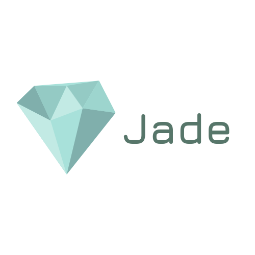

# El Lenguaje de programación Jade



## ¿Qué es Jade?

Jade es un lenguaje de programación en español.

```
imprimir("¡Hola mundo!")
```

## ¿De donde viene el nombre Jade?

Programar es el arte de crear. Es un proceso que requiere de concentración para
adentrarse a ese mundo místico donde fluye la inspiración. Los mayas creían que
el jade era la piedra de la creación y facilitaba el camino hacia el más
allá.[^1]

[^1]: http://mundomaya.travel/es/arqueologia/sabias-que/item/la-piedra-verde-era-mas-importante-que-el-oro.html

## ¿Por qué un lenguaje de programación en español?

Se dice que los programas deben escribirse para ser leidos por otras personas
y de paso para que sean ejecutados por una computadora. Hay muchas personas que
hablan español pero que no hablan inglés o no se sienten comodos con su nivel
de inglés. Mi intención con Jade es que aprender a programar sea un poco más
accesible a estas personas y que si siguen interesadas en continuar su
trayectoria como programadores, posteriormente puedan migrar a un lenguaje de
programación en inglés.
